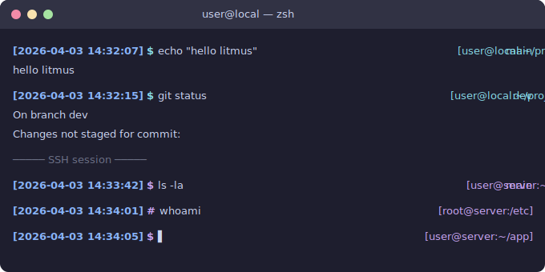

# litmus-zsh-theme

A color-reactive Zsh theme sensing local or SSH connections.



## Features

- **Connection-aware colors**: prompt turns **cyan** on local sessions and **magenta** over SSH, so you always know where you are.
- **Timestamps**: bold blue `[YYYY-MM-DD HH:MM:SS]` on every prompt line.
- **Git integration**: current branch displayed in the right prompt with a **blue ✔** (clean) or **green ✗** (dirty) indicator.
- **Root indicator**: prompt symbol switches from `$` to `#` when running as root.
- **Error highlight**: prompt and working-directory text turn bold on non-zero exit status.
- **Right prompt**: shows `[user@host:~/path]` alongside git info for full context without clutter on the left.

## Requirements

- [Oh My Zsh](https://ohmyz.sh/)

## Installation

### Oh My Zsh

1. Clone the repository into the Oh My Zsh custom themes directory:

   ```sh
   git clone https://github.com/dceoy/litmus-zsh-theme.git \
     "${ZSH_CUSTOM:-$HOME/.oh-my-zsh/custom}/themes/litmus-zsh-theme"
   ```

2. Symlink the theme file:

   ```sh
   ln -sf "${ZSH_CUSTOM:-$HOME/.oh-my-zsh/custom}/themes/litmus-zsh-theme/litmus.zsh-theme" \
     "${ZSH_CUSTOM:-$HOME/.oh-my-zsh/custom}/themes/litmus.zsh-theme"
   ```

3. Set the theme in `~/.zshrc`:

   ```sh
   ZSH_THEME="litmus"
   ```

4. Reload your shell:

   ```sh
   source ~/.zshrc
   ```

### Manual

Copy `litmus.zsh-theme` into your Oh My Zsh custom themes directory:

```sh
cp litmus.zsh-theme "${ZSH_CUSTOM:-$HOME/.oh-my-zsh/custom}/themes/"
```

Then set `ZSH_THEME='litmus'` in `~/.zshrc` and reload.

## Prompt Layout

```
[2026-04-03 14:32:07] $                          main✔ [user@host:~/project]
├── timestamp (blue) ──┘ └── symbol (cyan/magenta)  └── git + cwd (right prompt)
```

| Element                 | Description                         |
| ----------------------- | ----------------------------------- |
| `[YYYY-MM-DD HH:MM:SS]` | Bold blue timestamp                 |
| `$` / `#`               | Prompt symbol (normal user / root)  |
| `main✔`                 | Git branch + clean status (blue ✔)  |
| `dev✗`                  | Git branch + dirty status (green ✗) |
| `[user@host:~/path]`    | Working directory in right prompt   |

## Color Reference

| Context       | Color     |
| ------------- | --------- |
| Local session | Cyan      |
| SSH session   | Magenta   |
| Timestamp     | Bold blue |
| Git clean     | Blue ✔    |
| Git dirty     | Green ✗   |

## License

[MIT](LICENSE)
